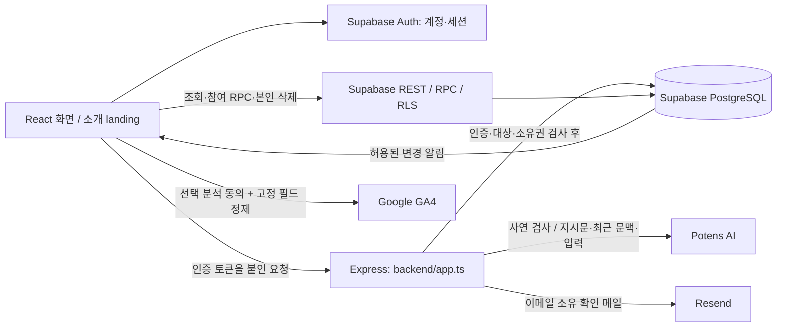
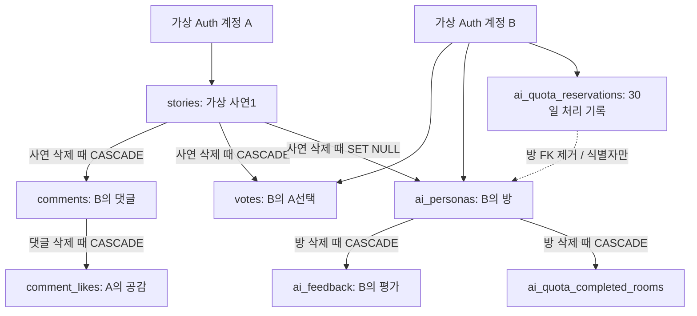

# 니편내편 Supabase·백엔드·DB 안내

**기준일: 2026-10-10 / 프로젝트: thinkerbell / 작업 브랜치: main**

이 문서는 새 팀원이 “어떤 행동이 어디에 저장되고, 누가 읽고 지우며, AI와 분석으로 무엇이 나가는가”를 따라 읽기 위한 안내다. 실제 이용자의 사연·대화·이메일·키·토큰을 포함하지 않는다. 예시는 모두 가상이다. 제품 정책은 [PLAN.md](PLAN.md), 보관·파기 확인 근거는 [정책.md](정책.md), 실행 상태는 [최신 인수인계](docs/plan-execution/README.md)가 기준이다.

**먼저 구분할 상태:** 운영 Supabase에는 public 테이블19개와 서버 저장·권한 정책이 존재한다. 추가 보안안 `read_visible_*` RPC/공개 반환 필드 제한은 **2026-10-10 사용자 승인 후 운영 적용·독립 readback 확인 완료**다. 새 앱 코드는 이 운영 RPC를 요구하며 클라이언트 배포 완료는 별도 상태로 확인한다. 첫행동 문구4부분은 최신 승인에 따라 main63b4494 푸시·공개랜딩 원문 확인 완료다. 개인정보 안내는 미활성 초안이다.

## 목차

1. [한눈에 보는 전체 지도](#1-한눈에-보는-전체-지도)
2. [실행·배포와 코드 읽는 순서](#2-실행배포와-코드-읽는-순서)
3. [Auth·Storage와 데이터 형식 읽기](#3-authstorage와-데이터-형식-읽기)
4. [public19테이블의 역할·핵심 타입·연결·권한](#4-public19테이블의-역할핵심-타입연결권한)
5. [가상 사연 한 건의 끝까지 흐름](#5-가상-사연-한-건의-끝까지-흐름)
6. [누구의 권한인가](#6-누구의-권한인가)
7. [공개·개인 숨김·비공개·블라인드의 차이](#7-공개개인-숨김비공개블라인드의-차이)
8. [보관·삭제·탈퇴·cron](#8-보관삭제탈퇴cron)
9. [외부로 나가는 정보](#9-외부로-나가는-정보)
10. [API·RPC·SQL 함수 찾아보기](#10-apirpcsql-함수-찾아보기)
11. [운영 현재와 로컬 보안 수정안](#11-운영-현재와-로컬-보안-수정안)
12. [테스트 방법과 결과 해석](#12-테스트-방법과-결과-해석)
13. [초기 기획과 현재 구현·미결정](#13-초기-기획과-현재-구현미결정)
14. [최근 요청별 완료·남은 일](#14-최근-요청별-완료남은-일)

## 1. 한눈에 보는 전체 지도

프론트가 모든 데이터를 자기 저장소에만 갖는 구조가 아니다. 화면은 Supabase 세션으로 계정을 알아보고, 공개 읽기와 일부 참여 RPC는 Supabase에 직접 요청한다. 사연·댓글·AI 저장은 Express API가 사용자 인증과 대상 소유권을 확인한 뒤 서버 전용 클라이언트로 처리한다. 따라서 **프론트 → API → DB 경로와 프론트 → Supabase 경로가 함께 존재**한다.



RLS는 “이 역할이 어떤 행을 읽고 쓰는가”를 정하는 DB 규칙이다. 테이블/열 grant는 “그 명령·열에 접근 가능한가”를 정한다. SECURITY DEFINER RPC는 함수 소유자 권한으로 실행되므로 함수 안에서 별도 인증·대상 검사가 중요하다. 서버의 service_role은 RLS를 우회할 수 있어 API 검사 없이 안전하다고 볼 수 없다. 화면에서 버튼을 숨기는 것은 이 검사들을 대신하지 않는다.

## 2. 실행·배포와 코드 읽는 순서

| 경로 | 팀원이 보는 역할 |
|---|---|
| [frontend/src/App.tsx](frontend/src/App.tsx) | 로그인 상태, 사연/댓글/AI 목록, 참여·삭제·모달·계정 전환 연결 |
| [frontend/src/lib/supabase.ts](frontend/src/lib/supabase.ts) | 브라우저 Supabase 클라이언트. 브라우저용 연결과 서버 전용 권한을 구분 |
| [backend/app.ts](backend/app.ts) | Express API, 사용자 인증, 사연/댓글 검사·저장, AI 방·턴·횟수·평가 처리 |
| [backend/emailOwnership.ts](backend/emailOwnership.ts) | 이메일 소유 확인, 단회 가입 증명, Resend 발송·Auth 계정 생성 |
| [backend/server.ts](backend/server.ts) | 로컬 서버 진입점. 개발 때 Vite 미들웨어, Production 때 dist 정적 제공 |
| [api/index.ts](api/index.ts) | Vercel 함수 진입점. 실제 API 구현은 backend/app.ts에 있음 |
| [vercel.json](vercel.json), [frontend/vite.config.ts](frontend/vite.config.ts) | Vite 앱·landing 빌드, API rewrite, `/landing` 연결 |
| [backend/supabase/README.md](backend/supabase/README.md), [마이그레이션](backend/supabase/migrations/) | DB 변경의 적용 이력과 SQL. 폴더 전체를 현재 운영에 자동 재적용하는 용도가 아님 |

루트 [package.json](package.json)의 `npm run dev`는 tsx로 backend/server.ts를 실행한다. 기본 포트는3000이며 PORT 설정이 있으면 달라진다. `npm run build`는 Vite로 앱/landing을 dist에 만들고 esbuild로 `dist/server.cjs`를 만든다. 로컬 Production은 빌드 후 `NODE_ENV=production npm start`다. 개발 서버도 설정에 따라 **운영 Supabase를 사용할 수 있다**. localhost라는 이유로 DELETE 시험이 안전한 로컬 DB라고 가정하지 않는다.

공개 주소는 `https://thinkerbell-eight.vercel.app/`, Supabase ref는 `vzhyhadjtaqbapicjrco`다. GitHub main 푸시와 Vercel 자동 배포가 연결되어 있으며 파비콘 커밋 `6e18aec`의 Production READY·동일 Source commit·공개 자산을 확인했다. 푸시 성공, Vercel READY, 공개 코드 일치, DB 적용, GA4 수신은 서로 다른 확인이다.

환경변수는 **이름만** 알아둔다. `VITE_SUPABASE_URL`, `VITE_SUPABASE_ANON_KEY`는 프론트 연결, `SUPABASE_URL`, `SUPABASE_ANON_KEY`, `SUPABASE_SECRET_KEY`는 서버 인증/저장, `POTENS_API_KEY`·`POTENS_MODEL`은 AI, `RESEND_EMAIL_CHECK_API_KEY`·`EMAIL_CHECK_ENABLED`·`EMAIL_CHECK_SECRET`·`APP_URL`은 가입 소유 확인, `AI_QUOTA_ACTIVATES_AT`·`AI_QUOTA_SERVER_READY`는 AI 전환, `VITE_GA4_ID`는 분석이다. 값은 이 문서에 없다. backend의 storySupabaseUrl은 서버/프론트 URL 불일치를 거부한다. Production/Preview 설정과 실제 적용 값은 별도 확인 대상이다.

## 3. Auth·Storage와 데이터 형식 읽기

**Auth:** `auth.users`는 public19테이블에 포함하지 않는다. 이메일/비밀번호/닉네임으로 계정 인증을 하고 계정UUID를 앱 데이터와 연결한다. Auth 메타데이터에 닉네임·설정이 있을 수 있지만 별도 public profiles 테이블이 확인된 구조는 아니다. 화면의 익명번호/닉네임과 DB의 계정 연결은 별개다. 인증정보 저장 방식·Auth 내부 로그/백업·전체 파기를 소스만으로 확정하지 않는다.

**Storage:** 최근 운영 화면에서 파일 버킷 없는 초기 상태를 확인했고 현재 소스에도 supabase.storage 업로드 경로가 없다. 공유 이미지는 브라우저에서 만들어 다운로드한다. 이 사실은 Vercel/DB/AI 업체의 로그·백업까지 저장되지 않는다는 뜻은 아니다.

**타입 근거 표기:** 아래 `SQL`은 저장소의 적용기록 SQL에 명시된 타입이다. `운영`은 확보된 메타데이터/정의 확인이다. `계약`은 API/TypeScript/격리 fixture가 사용하는 형태이며 **운영 DB 실제 타입의 새 덤프가 아니다**. 옛10테이블 구조 문서와 이번19테이블 관찰을 구분했다. 원본 SQL이 저장소에 없는 테이블의 전체 타입/FK는 미확인으로 남겼다. 특히 TypeScript string에는 DB의 text·uuid·timestamptz가 모두 들어올 수 있다.

- `text`: 문자열. stories/comments의 createdAt은 초기 추출 SQL에서 **text**였다. API에서 ISO 날짜처럼 보여도 모든 시각 열이 timestamptz인 것은 아니다.
- `uuid`: 계정/요청 같은 식별자. stories.authorId는 text라 Auth UUID 문자열과 비교한다.
- `integer`, `smallint`, `bigint`: 집계·점수·자동 증가 ID 등의 정수. `boolean`: 상태. `date`: 날짜. `timestamptz`: 시간대 포함 시각.
- `jsonb`: JSON을 담는 DB 타입. AI 메시지를 별도 messages 테이블이 아닌 ai_personas.chatHistory 배열에 저장한다.
- `CASCADE`: 부모 삭제에 자식도 삭제. `SET NULL`: 자식은 남고 연결 열만 NULL. 이름이 user_id라고 자동으로 Auth FK가 생기는 것은 아니다.

## 4. public19테이블의 역할·핵심 타입·연결·권한

19개 실제 이름은 아래와 같다. 개별 설명의 읽기/쓰기는 일반 앱 역할 기준이며 DB 관리자·서버 권한은 별도다. 운영19테이블의 RLS 활성과 정책 목록은 확인했으나 모든 타입/기본값/FK를 이번 문서 작성 중 다시 추출한 것은 아니다.

### 사연과 참여: 7개

**1) `stories` — 사연 한 건의 본문과 공개 상태**

- 핵심 타입(SQL): `id, authorId, authorNickname, title, body, category, createdAt: text`; `votesA, votesB, commentCount, viewCount, reportsCount, weeklyRank: integer`; `isHot, isWeeklyTop, isBlind, isAdult, isHidden: boolean`; `personaName, personaInstruction, cardColor, appealStatus, appealText, visibility: text`; `appealedAt: timestamptz`. 최근 운영25열 이름·모든 열 SELECT grant를 확인했다.
- 쌓이는 때: 사연 작성 성공에1행. 댓글/투표/신고/조회 때 관련 집계가 바뀌고 공개상태·이의제기 때 상태가 바뀐다. 사연에는 별도 일반 updatedAt 열이 확인된 목록에 없으며 AI 방 updatedAt과 혼동하지 않는다.
- 연결: id가 댓글/투표/숨김의 기준. authorId는 Auth UUID의 문자열 연결이며 해당 Auth FK의 현재 존재는 이번 자료에서 확정하지 않는다.
- 주체: 일반 읽기는 공개·비블라인드·비성인·비숨김 또는 작성자. INSERT/UPDATE는 API 서버 경로; 브라우저 직접 쓰기 정책은 닫힌 적용 기록. DELETE는 authenticated 작성자 RLS 및 실제 현재 세션·응답ID 확인. `vote_story`, `set_story_visibility`, `submit_report` 등은 함수 내부 검사를 거친다.

**2) `comments` — 사연에 붙는 댓글**

- 핵심 타입(SQL): `id, storyId, authorId, anonymousId, content, createdAt, authorVoted, appealStatus, appealText: text`; `likeCount, reportsCount: integer`; `isBlind, isEdited: boolean`; `appealedAt: timestamptz`. 최근 운영14열 이름 확인.
- 쌓이는 때: API 댓글 저장에1행. 익명번호 부여 트리거와 댓글 수 동기화가 있다. 수정은 본인 API, 공감은 like_comment로 바뀐다.
- 연결: 운영관찰 기록의 `storyId → stories.id ON DELETE CASCADE`. 초기8/17 SQL의 ‘FK 없음’ 주석은 과거다. authorId는 계정 문자열 연결; 현재 Auth FK 전체 타입/동작은 미재확인.
- 주체: 운영 SELECT RLS는 부모 사연 공개/작성자 조건. 적용 전에는 댓글 자신의 isBlind 제외가 없었으며 2026-10-10 운영 보안 적용으로 원문 SELECT를 차단하고 RPC에서 블라인드 내용을 제외했다. 서버가 생성/수정, 작성자가 삭제. 로컬안은 블라인드 내용을 RPC에서 제외하며 본인 삭제에 필요한 최소 식별열은 유지한다.

**3) `votes` — 계정당 사연별 투표**

- 핵심 타입(SQL): `storyId:text`, `userId:uuid`, `option:text(A/B)`, `changeCount:integer`, `createdAt,updatedAt:timestamptz`; 복합PK `(storyId,userId)`. id·side라는 별도 열을 임의 추가해 설명하지 않는다.
- 쌓이는 때: 최초 vote_story 호출에1행, 선택 변경 때 같은 행을 갱신. 같은 선택 재시도는 집계를 다시 올리지 않고 변경은 최대1회다. 사연 행을 먼저 잠가 최초 동시 투표도 직렬화한다.
- 연결: 운영관찰 기록의 사연 FK CASCADE. Auth FK 전체는 미재확인이며 탈퇴 함수에 직접 삭제 경로가 있다.
- 주체: 본인 SELECT. 직접 INSERT/UPDATE보다 authenticated vote_story 함수로 기록한다. 본인 사연 투표·비공개/성인/숨김/블라인드 대상은 함수가 거부한다.

**4) `comment_likes` — 계정별 댓글 공감 기록**

- 핵심 타입(SQL): `comment_id:text`, `user_id:uuid`, `created_at:timestamptz`; 복합PK `(comment_id,user_id)`.
- 쌓이는 때: like_comment `+1`은 공감 상태를 보장, `-1`은 해제한다. 반복 호출을 산술+1/-1로 해석하지 않는다. INSERT/DELETE 트리거가 comments.likeCount를 실제 행 수로 맞춘다.
- 연결(SQL): 댓글 및 auth.users에 모두 CASCADE.
- 주체: 본인 SELECT, 직접 일반 쓰기 없음, 로그인한 사용자의 RPC 및 종속삭제/서버 처리.

**5) `story_hides` — 나에게만 숨긴 사연**

- 핵심 타입(SQL): `user_id:uuid`, `story_id:text`, `created_at:timestamptz`; 복합PK `(user_id,story_id)`.
- 쌓이는 때: 개인 숨김에1행, 되돌리기에 제거. stories.isHidden이나 visibility를 바꾸지 않는다.
- 연결(SQL): user_id→auth.users, story_id→stories, 모두 CASCADE.
- 주체: authenticated 본인 SELECT/INSERT/DELETE, 대상 사연 접근 검사. 다른 사람의 피드에는 영향이 없다.

**6) `balance_votes` — 밸런스 게임 선택**

- 확보된 열 이름: `gameId,userId,option,changeCount,createdAt,updatedAt`. 앱 계약은 gameId:number(고정 질문 ID), userId:계정UUID 문자열, option:A/B, changeCount:정수, 시각:문자열. **운영 SQL 타입(integer/bigint, text/uuid, 시각 타입)과 PK 전체는 현재 확보본에서 미재확인**이다.
- 쌓이는 때: vote_balance_game으로 최초 선택·변경. balance_game_state가 집계/내 선택을 가져온다. 질문 정의는 [BalanceGameSection](frontend/src/components/BalanceGameSection.tsx)에 있으며 별도 public 질문 테이블은19목록에 없다. 질문 ID를 바꾸면 기존 표와 끊긴다.
- 연결: userId의 계정 FK 존재는 앞선 메타데이터에서 관찰했지만 실제 CASCADE 동작은 최신 재검증 필요. gameId는 앱 질문에 대한 논리 연결이며 사연 FK가 아니다.
- 주체: 개인 행은 본인 정책, 공개 결과는 RPC 집계. 사용자가 임의 집계 숫자를 저장하는 경로로 이해하지 않는다.

**7) `story_access_invalidations` — 내용 없는 캐시 무효화 신호**

- 핵심 타입(SQL): `id:bigint identity PK`, `story_id:text`, `changed_at:timestamptz`.
- 쌓이는 때(운영): 사연 공개해제/차단 상태 변경·삭제 트리거가 사연ID만 INSERT한다. 이미 받은 공개 캐시가 다음 SELECT에서 사라졌음을 알려준다.
- 연결: 사연을 지운 뒤에도 신호를 유지해야 하므로 source SQL에 사연 FK는 없다.
- 주체: anon/authenticated SELECT와 Realtime, 일반 쓰기 없음. 서버/트리거 INSERT,30일 정리. **로컬안만** access_changed:boolean을 추가하고 일반 내용·댓글 변경도 ID 신호로 전달한다. 운영에 이4번째 열이 있다고 설명하지 않는다.

### AI: 6개

**8) `ai_personas` — AI 대화방과 메시지 정본**

- 확보된 이름: `id,userId,name,role,category,avatarIcon,description,systemInstruction,cardColor,sampleFirstMessage,isPinned,chatHistory,storyId,opening,ratio,createdAt,updatedAt`. chatHistory:jsonb는 운영 구조 문서 근거. 나머지 핵심 계약/격리 fixture는 id/storyId:text, userId:uuid, 문자열 설정:text, isPinned:boolean, createdAt/updatedAt:timestamptz다. **이를 모든 운영 열 타입의 신규 조회로 확대하지 않는다.**
- 쌓이는 때: `/api/ai/rooms`가 저장된 사연에서 지시문·설명을 만들고 방을 생성. 같은 계정·사연·상황 시작점 또는 공감 비율은 재사용하도록 부분 UNIQUE 인덱스가 있다. 턴 완료에 chatHistory 배열 append와 updatedAt 변경, 고정/관점도 서버 PATCH로 갱신.
- 연결: storyId→stories SET NULL은 최근 실환경 FK 확인. Auth 연결/탈퇴 연쇄는 기존 정의·탈퇴 함수 근거이고 전체가상탈퇴 시험은 미실행.
- 주체: authenticated 본인 SELECT(userId=auth.uid()) 실환경 확인, 본인 DELETE; 직접 일반 INSERT/UPDATE는 차단 적용기록, 서버가 생성/저장. 방 주인과 사연 작성자는 다를 수 있다.

**9) `ai_chat_usage` — 전환 전 방 생성 차감 이력**

- 실제 이름은 `id,userId,storyId,usedAt,usedOn`. createdAt/quotaDate라고 쓰면 현재 API와 어긋난다. 계약/격리 SQL은 id/userId:uuid, storyId:text(nullable), usedAt:timestamptz, usedOn:date이며 전체 운영 타입은 미재조회.
- 쌓이는 때: legacy 모드의 타인 사연 신규 방 생성 시 open_legacy_ai_room에서 방 생성과 같은 트랜잭션으로1행. 일반 사용량은 해당 한국 날짜의 행을 센다.
- 연결: 운영관찰 사연 FK SET NULL. 계정 삭제 연쇄는 기존 정의 근거. 현재 legacy 사용 이력 전부의 기간별 정리는 미확인.
- 주체: 본인 SELECT, 직접 브라우저 INSERT/UPDATE/DELETE는 닫힌 정책/권한 적용기록; 서버 저장. aiQuota.ts에 옛 직접 INSERT 함수가 남아 있어도 운영 허용의 증거가 아니다.

**10) `ai_quota_completed_rooms` — 첫 성공 답변 완료 표시**

- 핵심 타입(SQL): `persona_id:text PK`, `user_id:uuid`.
- 쌓이는 때: 서버 첫 성공 답변 차감 완료 때 방별 표식1행. 메시지 본문은 없으며 이후 턴의 재차감을 막는다.
- 연결(SQL): persona_id→ai_personas CASCADE. user_id에는 해당 SQL의 Auth FK 명시가 없다.
- 주체: 일반 SELECT/직접 쓰기 없음, service_role 및 서버 RPC 처리. 방 삭제에 같이 제거.

**11) `ai_quota_reservations` — 첫 답변 슬롯 예약·완료·반환**

- 핵심 타입(SQL): `id,user_id,request_id:uuid`, `persona_id:text`, `quota_day:date`, `status:text(reserved/completed/returned/expired)`, `reserved_at,expires_at,finished_at:timestamptz`; UNIQUE `(user_id,request_id)`와 방별 진행/완료 부분 UNIQUE.
- 쌓이는 때: 처음 실제 AI 요청에서90초 슬롯 예약. 정상 저장 완료는 completed, 실패는 returned, 정리는 expired로 바꾼다. 종료 기록은 finished_at부터30일 기준 삭제한다.
- 연결: **9/29 후속 SQL에서 persona_id FK를 제거했다.** 방을 지워도 횟수를 초기화하지 않으려는 설계다. user_id Auth FK도 해당 정의에 없다. 대화 원문은 저장하지 않는다.
- 주체: 일반 직접 접근 없음, service_role의 reserve/finish/purge RPC. 계정 탈퇴 후 식별자 잔류 가능성은 전체 파기 검증 공백이다.

**12) `ai_feedback` — 개인 도움 평가 또는 건너뛰기**

- 핵심 타입(SQL): `episode_id:uuid PK`, `user_id:uuid`, `persona_id:text`, `mode:text`, `score:smallint nullable(1~5)`, `outcome:text(submitted/skipped)`, `schema_version:smallint`, `created_at,expires_at:timestamptz`. rating/month_key/submitted_at/updated_at 열을 현재 정의처럼 추가하지 않는다.
- 쌓이는 때: 정상 저장 AI 답변이 있는 에피소드의 마무리 평가 API. 서버가 방 소유권·저장 답변·모드를 확인한다. 답변 원문은 이 테이블에 넣지 않는다.
- 연결(SQL): persona_id→ai_personas CASCADE. user_id Auth FK 명시 없음. 같은 에피소드 재전송은 동일값이면 회복, 바꾸면 충돌.
- 주체: 일반 직접 SELECT/INSERT 없음, 서버 service_role. 운영 버전1은1~5점. **로컬 추가 버전2**는3단계 도움 안 됨/보통/도움 됨→1/3/5, 기존 기록 재작성 없음. expires_at 기본29일+일일정리로 최대30일 정책.

**13) `ai_feedback_month_pending` — 월 집계의 임시 처리 상태**

- 핵심 타입(SQL): `month_start:date PK`, `rated_count,positive_count:integer`.
- 쌓이는 때: 만료된 개인 평가를 purge_ai_feedback가 점수 응답 수/긍정 수로 합친다. 사용자ID·방ID·모드·점수별 셀은 없다.
- 연결: 식별자 FK 없음. 월 단위 계산 자료이지 별도 이용자 평가 행이 아니다.
- 주체: service_role 전용. 지난달의 서로 다른 점수 응답자5명 조건을 증명하지 못하면 임시 합계를 버린다.

**14) `ai_feedback_monthly_totals` — 조건을 충족한 월 합계**

- 핵심 타입(SQL): `month_start:date PK`, `rated_count,positive_count:integer`, `finalized_at:timestamptz`.
- 쌓이는 때: 월말 이후5명 조건을 확인한 월만 확정. 두 모드 합계이며 장기 개인 점수·일별·모드별 분포는 없다.
- 연결: 계정·대화 FK 없음. positive_count는 기존 score>=4, 로컬3단계에서는5점에 해당한다.
- 주체: 서버/정리 함수, 일반 조회 없음. 실제 운영 월말 집계 성공은 미검증이며 ‘응답자 만족도’를 전체 이용자 만족도로 바꾸어 보고하지 않는다.

### 가입·운영·분석: 6개

**15) `signup_email_checks` — 이메일 소유 확인·단회 가입 증명**

- 핵심 타입(SQL): `id:uuid PK`; `email_digest,token_digest,signup_digest:text`; `created_at,expires_at,consumed_at,signup_started_at:timestamptz`. digest는 규정된 해시 형식이고 signup_digest/소비 시각은 nullable.
- 쌓이는 때: 메일 발송 전 예약, 메일 링크 검증 때 소비, 새 계정 가입 시작 때 단회 claim. 확인 전 계정 존재 여부를 노출하지 않는다.
- 연결: source SQL에 Auth FK 없음. 서버는 이메일 정규화/HMAC·토큰 해시를 DB에 넣고 **암호화된 확인 토큰은 메일 링크에** 담는다. 현재 SQL에 sealed_token·평문 이메일 저장 열이 있는 것으로 설명하지 않는다.
- 주체: 일반 테이블 접근/RPC 실행 없음, service_role 서버 전용. 확인 링크10분 유효, created_at24시간 이후 정리·15분 주기. 링크 자체와 해시값도 문서에 복사하지 않는다.

**16) `inquiries` — 내 문의·운영 답변**

- 앱 인터페이스의 실제 사용 이름: `id,userId,category,content,status,reply,repliedAt,createdAt`. API 계약은 문자열, reply/repliedAt은 nullable. **id의 uuid/text 구분·시각 SQL 타입 및 FK 원본은 현재 확보본에서 미확인**이다.
- 쌓이는 때: 로그인한 사용자 문의·AI 오류 접수에1행, 운영자 답변 때 reply/status/repliedAt 갱신. 답변은 앱 안에서 확인한다. 코드 주석의 ‘메일 발송 수단 없음’은 문의 답변에 대한 설명이며 Resend 가입 메일 경로와 구분한다.
- 연결: userId로 Auth 계정 연결. 탈퇴 후 문의 전체 파기는 최신 실증이 없다.
- 주체: 본인 INSERT/SELECT, 운영자 SELECT/UPDATE 정책. 일반 사용자 임의 수정·삭제 경로 없음. [inquiries.ts](frontend/src/lib/inquiries.ts), [운영자 안내](docs/admin.md).

**17) `admins` — 앱 운영 역할의 판정 자료**

- 운영2열 존재 관찰. 코드/기존문서에서 `userId` 사용을 확인했으며 **나머지 열 이름·SQL 타입·현재 FK 전체는 미확인**이다. 계정 UUID 형태라고 열을 uuid로 새로 단정하지 않는다.
- 쌓이는 때: 권한이 있는 운영 절차로 역할 등록/해제. 일반 가입으로 자동 생기지 않는다.
- 연결: is_admin이 현재 Auth 계정과 대조한다. 본인 AI 방 소유권을 운영 역할로 대체하지 않는다.
- 주체: 일반 읽기 정책 없음, is_admin 판정 사용. 역할 변경은 별도 승인 사항이다. 기존 지정 계정 기록을 새 담당자 권한의 증거로 쓰지 않는다.

**18) `reports` — 고유 신고자의 신고**

- 핵심 타입(SQL): `targetType,targetId,reason:text`, `reporterId:uuid`, `createdAt:timestamptz`; 복합PK `(targetType,targetId,reporterId)`. 최근 운영5열과 일치하며 별도 id열을 임의로 넣지 않는다.
- 쌓이는 때: submit_report가 대상 공개 여부·중복·일일 한도를 검사하고1행. 고유 신고 수로 stories/comments의 reportsCount/isBlind를 갱신한다. 댓글3명, 사연5명 또는3명+조회10+비율5% 기준은 현재 함수 근거.
- 연결: targetType에 따라 targetId가 사연/댓글을 가리키는 **논리 연결**. 일반 targetId FK로 모든 대상 삭제가 자동정리된다고 설명하지 않는다.
- 주체: 본인 SELECT, authenticated RPC 작성. 탈퇴 함수의 reporterId 직접 삭제를 확인했으나 대상 삭제 전체·보유기간은 미확정이다.

**19) `events` — 내부DB 기존9종 분석**

- 핵심 타입(SQL): `id:uuid PK`, `session_id,event_name:text`, `user_id:uuid nullable`, `props:jsonb`, `created_at:timestamptz`.
- 쌓이는 때: 분석 동의 후9종(app_open/login_success/story_view/vote_submit/ai_entry_click/ai_mode_select/ai_start_select/ai_chat_turn1/ai_chat_turn3)만 DB에 저장. 새 일반 화면·클릭·결과 전체는 GA4 전용이며 이 테이블에 모두 늘리는 정책이 아니다.
- 연결: nullable user_id와 props 속 논리 대상ID. 명시적 Auth/사연 FK가 해당 SQL에는 없다.
- 주체: anon/authenticated INSERT, user_id는 null 또는 auth.uid() 조건; 일반 SELECT 없음. 내부 props 보관·탈퇴 제거는 GA4 정제 규칙과 별개이며 전체기간 미확정이다.

## 5. 가상 사연 한 건의 끝까지 흐름

아래 A는 사연 작성자, B는 읽고 참여하며 AI 방을 만든 사람이다. 가상의 이야기 “약속 시간에 늦은 친구에게 서운했다”를 끝까지 따라간다. 실제 DB에 이 예시를 저장하지 않았다. AI 횟수 부분은 **서버 첫 답변 차감 모드의 가상 분기**를 설명하고 legacy 차이를 따로 적는다. 운영의 전환 시각/준비 플래그를 이번 문서 작성에서 새로 읽거나 변경하지 않았다.



### ① A가 가입하고 사연을 쓴다

이메일 소유 확인 경로는 `/api/auth/email-check/request → verify → signup` 순서다. 서버가 확인메일을 보내고 확인한 단회 증명으로 Auth 계정을 생성한다. 확인 전 이미 가입했는지 다른 사람에게 알려주지 않는다. 설정에 따른 Supabase 가입 fallback도 WelcomeModal에 있으므로 한 가입 경로만 보고 전체 동의/우회 방지가 끝났다고 생각하지 않는다. 신규 계정 생성 성공으로 확인된 경우만 계정당1회 소개로 이동한다. 기존 로그인·세션 복원은 자동 소개 대상이 아니다.

A가 작성하면 API가 세션의 실제 계정ID를 사용한다. 프론트가 보낸 authorId를 그대로 믿어 남의 사연을 만들지 않는다. requestId 기반 재시도로 중복 저장을 피하고 내용 검사를 거친다.

```json
{
  "stories": {
    "id": "aaaaaaaa-aaaa-4aaa-8aaa-aaaaaaaaaaaa",
    "authorId": "11111111-1111-4111-8111-111111111111",
    "authorNickname": "가상 작성자",
    "title": "약속 시간에 늦은 친구에게 서운했어요",
    "body": "가상 예시: 늦은 친구와 차분히 이야기하고 싶어요.",
    "category": "친구",
    "visibility": "public",
    "votesA": 0,
    "votesB": 0,
    "commentCount": 0,
    "isBlind": false,
    "isAdult": false,
    "isHidden": false
  }
}
```

이는 핵심 열만 보여준 설명용 JSON이다. 전체 INSERT payload나 그대로 실행할 SQL이 아니다.

### ② B가 보고 투표·댓글, A가 공감한다

B가 `vote_story(사연ID,'A')`를 부르면 B의 votes 행이 생기고 stories.votesA가1이 된다. 같은 요청을 다시 해도1을 유지한다. B의 댓글은 `/api/comments`에서 검사·저장하고 comments.storyId가 사연을 잇는다. assign_comment_anon_id는 댓글 익명 표시번호, sync_story_comment_count는 사연 댓글 수를 관리한다. A가 공감하면 comment_likes에 계정/댓글 조합1행이 생기고 likeCount가1이 된다. 재클릭하면 그 조합을 지워0이 된다.

```json
{
  "votes": {
    "storyId": "aaaaaaaa-aaaa-4aaa-8aaa-aaaaaaaaaaaa",
    "userId": "22222222-2222-4222-8222-222222222222",
    "option": "A",
    "changeCount": 0
  },
  "comments": {
    "id": "bbbbbbbb-bbbb-4bbb-8bbb-bbbbbbbbbbbb",
    "storyId": "aaaaaaaa-aaaa-4aaa-8aaa-aaaaaaaaaaaa",
    "authorId": "22222222-2222-4222-8222-222222222222",
    "anonymousId": "익명 1",
    "content": "가상 예시: 서로 약속 기준을 이야기해 보세요."
  },
  "comment_likes": {
    "comment_id": "bbbbbbbb-bbbb-4bbb-8bbb-bbbbbbbbbbbb",
    "user_id": "11111111-1111-4111-8111-111111111111"
  }
}
```

익명 1이라는 화면 표시는 실제 authorId 연결이 사라졌다는 뜻이 아니다. 운영 현재는 RLS를 통과한 사연/댓글의 내부 열까지 SELECT할 수 있는 grant가 남아 있다. 아래11절 로컬안은 표시만 바꾸는 대신 API 반환 열과 RPC·Realtime까지 제한한다.

### ③ B가 AI 모드를 선택하고 방을 만든다

B가 상황/시작점을 선택하면 `/api/ai/rooms`는 DB의 사연을 읽어 지시문을 구성한다. B의 개인 숨김·대상 접근·같은 선택의 기존 방을 검사한다. 사연 주인은 A, 방 주인은 B다. A에게 B의 AI 원문을 읽을 권한이 생기지 않는다. 같은 계정·사연·상황 시작점 또는 공감 비율로 재진입하면 방을 재사용한다.

```json
{
  "ai_personas": {
    "id": "persona-cccccccc-cccc-4ccc-8ccc-cccccccccccc",
    "userId": "22222222-2222-4222-8222-222222222222",
    "storyId": "aaaaaaaa-aaaa-4aaa-8aaa-aaaaaaaaaaaa",
    "opening": "apology",
    "ratio": null,
    "systemInstruction": "가상 예시: 저장된 사연에서 구성한 친구 역할 지시",
    "chatHistory": []
  }
}
```

로컬 모달 수정은 닫기/Escape/브라우저뒤로/설정 취소 때 원래 사연 상세를 보존한다. 계정·선택 세대·대상 접근이 바뀐 뒤 늦게 끝난 요청이 새 화면을 여는 것도 막는다. 이 추가 UX는 main63b4494에 포함돼 공개됐고 합성 브라우저에서 취소/초안/포커스 복귀를 확인했다.

### ④ 실제 요청과 답변 완료·저장을 분리한다

`/api/chat-stream`은 소유 방과 DB 문맥을 확인한 후 외부 AI에 요청한다. 서버 첫 답변 모드에서는 첫 요청에90초 예약을 만들고 한국 요청 날짜의3회 한도를 검사한다. provider_done은 정상 외부 응답 완료이고 DB 저장 성공과 다르다. complete_ai_turn은 같은 requestId 중복을 확인한 뒤 사용자/AI 메시지 쌍 append·updatedAt·첫 차감 완료를 원자 처리한다. 저장 실패는 정상 저장인 척하지 않고 예약 반환·오류로 구분한다.

```json
{
  "ai_quota_reservations": {
    "user_id": "22222222-2222-4222-8222-222222222222",
    "persona_id": "persona-cccccccc-cccc-4ccc-8ccc-cccccccccccc",
    "request_id": "dddddddd-dddd-4ddd-8ddd-dddddddddddd",
    "quota_day": "2026-10-10",
    "status": "completed"
  },
  "chatHistory": [
    {"sender": "user", "text": "가상 예시: 서운함을 어떻게 말할까요?", "requestId": "dddddddd-dddd-4ddd-8ddd-dddddddddddd"},
    {"sender": "ai", "text": "가상 예시 답변", "requestId": "dddddddd-dddd-4ddd-8ddd-dddddddddddd"}
  ]
}
```

실제 저장 메시지에는 id와 표시 timestamp도 있다. 이 JSON은 관계 설명용 요약이다. 같은 requestId 재전송은 저장된 답변 회복으로 처리하고 재저장·재차감을 피한다.

**legacy 차이:** 전환 전에는 타인 사연 새 방 생성과 ai_chat_usage 차감을 open_legacy_ai_room에서 같이 처리한다. 활성화 시각 이전의 옛 방 이어하기 예외도 있다. 첫 정상 답변 모드를 도입하는 것과 그 시각 설정을 실제 운영에서 켜는 것은 별도이며 자정 횟수 전환 추가 확인은 보류된 요청이다.

### ⑤ B가 대화를 마무리하고 평가한다

정상 저장된 답변이 있는 에피소드만 평가한다. 마무리는 방 삭제가 아니다. 새 로컬 UI3단계는 schema_version2의1/3/5로 저장하고 기존 버전1의1~5점은 유지한다. 건너뛰기는 score:null/outcome:skipped다. 서버는 같은 에피소드의 값/버전 충돌을 거부한다. 점수는 GA4에 보내지 않는다.

```json
{
  "ai_feedback": {
    "episode_id": "dddddddd-dddd-4ddd-8ddd-dddddddddddd",
    "user_id": "22222222-2222-4222-8222-222222222222",
    "persona_id": "persona-cccccccc-cccc-4ccc-8ccc-cccccccccccc",
    "mode": "simulation",
    "score": 5,
    "outcome": "submitted",
    "schema_version": 2
  }
}
```

버전2는 **main63b4494에 포함된 합성 검증 예시**다. 평가에 대화 원문은 넣지 않으며 평가 제출만으로 방 updatedAt을 바꾸지 않는다. 개별 평가는 대화방6개월과 별개의 최대30일 보관 대상이다.

### ⑥ A가 비공개로 바꾼 뒤 사연을 삭제한다

A의 set_story_visibility('private')는 타인 신규 사연/댓글 조회와 새 참여를 막고 A는 자기 사연을 볼 수 있다. 기존 B 방에 이미 복사된 문맥을 소급 제거하는 처리가 아니다. A가 사연을 지우면 댓글·투표는 CASCADE, AI 방과 ai_chat_usage의 storyId는 SET NULL이다. 그래서 B 방은 남을 수 있다. 다만 활성화 이후 방의 새 턴에는 부모 사연 존재 검사가 있어 **기록이 남는다와 계속 새 대화 가능하다는 다르다**.

B가 자기 AI 방을 지우면 그 방의 평가·완료 표시는 종속 삭제되고 예약 이력은 방 FK 제거로 남아30일 정책을 따른다. “방 삭제로 무료 횟수가 원상복구된다”는 동작을 만들지 않는다.

### ⑦ 탈퇴와 남은 기록을 확인한다

MyPageView의 delete_my_account는 현재 Auth 사용자를 대상으로 한다. 확보된 운영 함수 본문에는 본인 사연/댓글/투표/신고, 내 사연의 자식과 auth.users 삭제 경로가 있다. 일부 관계는 FK CASCADE를 사용한다. **추가19테이블 전부·외부로그/백업 파기의 최근 실증은 없다.** 예약 user_id에는 Auth FK가 없고 탈퇴 직접 제거도 확인되지 않아 잔류 가능성을 보류사항으로 남긴다. events.props·문의·신고 대상·메일확인 등도 전체 삭제를 약속하지 않는다. 계정 삭제를 기존 이용자 데이터로 시험하지 않았다.

## 6. 누구의 권한인가

| 주체 | 읽는 범위 | 생성·변경·삭제 | 구분할 점 |
|---|---|---|---|
| 비로그인 anon | 안전한 공개 사연/부모조건 댓글, 공개 집계 RPC | 정해진 조회/동의 분석 경로. 사연·댓글·AI 본문 저장/작성자 삭제 권한 없음 | 실제 UI의 임시 게스트 ID는 Auth 로그인 증명이 아님 |
| authenticated 일반 이용자 | 공개 콘텐츠 + 자기 투표/공감/숨김/문의/AI | API/RPC로 참여·저장, 본인 정책으로 삭제 | 남의 계정ID를 payload에 적어 권한을 얻지 않음 |
| 사연 작성자 | 자신의 사연(비공개 포함)·정책상 부모 댓글 | 본인 API수정/삭제·visibility·이의제기 | 그 사연을 읽은 사람의 AI 방 주인은 아님 |
| AI 대화방 주인 | userId가 자기인 방·원문 | 서버에 자기 방 턴/핀/관점, 본인 DELETE | 사연 작성자와 일치하지 않을 수 있음 |
| 앱 운영자 | 일반 본인 범위 + 운영 문의 조회/답변 | 문의 관리자 정책·등록된 운영 역할 | 타인 AI 자유조회 권한을 자동 부여하지 않음 |
| 서버 service_role | RLS 우회 가능한 서버 데이터 경로 | API가 검증한 저장·서버 RPC·정리 | API에 인증·소유권·상태 검사가 반드시 필요 |
| Supabase 콘솔/DB 관리 권한자 | 부여된 관리 권한 범위 | SQL/정책/권한/데이터 조작 가능 | 일반 앱 운영 역할·RLS와 별개. 실제 조직권한은 추가 확인 |

브라우저 DELETE는 “요청이204였나”만 보면 안 된다. 삭제된 대상ID가 반환되었는지·행이 보존됐는지 확인해야 한다. deleteOwnedStory는 세션·계정 전환·authorId 조건·응답ID를 대조한다. 격리REST에서는 토큰 없음/타인은 성공형 HTTP여도 행이 보존됐고 무효 토큰은 거부됐다. 이를 팀원 제보의 실제 운영 재현으로 확대하지 않는다.

## 7. 공개·개인 숨김·비공개·블라인드의 차이

| 상태 | 저장 위치 | 누구에게 영향 | AI/참여와의 관계 |
|---|---|---|---|
| 공개 | stories.visibility='public' + 안전상태 | 일반 사연 조회 가능 | 대상 검사를 통과해야 참여/새 방 가능 |
| 개인 숨김 | story_hides의 내 계정·사연 조합 | 나에게만 숨김 | 내 새 방 생성에서도 개인 숨김 확인 |
| 작성자 비공개 | stories.visibility='private' | 작성자 이외 사연/댓글 접근 제한 | 새 타인 참여 차단, 이미 복사된 방 문맥은 별도 |
| 운영 숨김/성인/블라인드 | isHidden/isAdult/isBlind | 공개 안전 조회·참여 제한 | 작성자 자기조회 예외와 새 방·새 턴 검사를 구분 |
| 댓글 블라인드 | comments.isBlind | 댓글 자체의 내용 | 현재 운영 부모 RLS만으로는 제외되지 않는 공백. 로컬안이 별도 차단 |

뷰에서 숨기는 것, DB가 행을 반환하지 않는 것, 이미 내려간 원문을 캐시에서 제거하는 것은 다른 층이다. Realtime도 읽기 경계의 일부다. 실제 운영에는 stories/comments/story_access_invalidations publication 관찰 기록이 있고 로컬안은 원형 stories/comments publication을 제거한다.

## 8. 보관·삭제·탈퇴·cron

AI 방의 기준은 **최종 수정 updatedAt부터6개월**이다. 생성·대화 마무리 시각·마지막 메시지만을 뜻하지 않는다. 턴 완료, 고정/관점 변경도 updatedAt에 영향을 줄 수 있다. 조건은 운영 함수의 `"updatedAt" < now() - interval '6 months'`이며 경계와 같은 시각은 `<`에 포함되지 않는다.

| 정리 대상 | 확인한 운영 예약 | 기준·확인 한계 |
|---|---|---|
| AI 방 | 기존 job1 purge-stale-ai-personas, GMT `1 15 * * *` = 매일00:01KST, active=true | 사용자 승인으로 기존 시각만 변경/readback. 함수/command해시·작업수4 유지.6개월 조건 불변 |
| 가입 소유 확인 |15분 주기 | created_at24시간 이후 제거 소스. 확인 링크10분 유효와 DB 정리 시각은 별개 |
| AI 예약·개인평가 | 매일03:00KST | 종료예약30일, 개인평가29일 만료+일일 정리. 이번 예약 변경 없음 |
| 접근 변경 신호 | 매일03:05KST |30일 기준 소스. 이번 예약 변경 없음 |

조건 충족 뒤 다음 일일 작업에 정리된다. ‘6개월에 즉시 완전 파기’나 플랫폼 백업/로그까지 같은 시각 제거를 약속하지 않는다. 이전 succeeded51건은 작업 성공 상태이고 실제 삭제 행 수 증거가 아니다. 함수 즉시 실행·실제 이용자 대상 삭제 시험은 하지 않았다. 검증 시점 다음 예약은2026-10-10 15:01UTC/10-11 00:01KST였으며 현재 다음 실행 시각을 새로 조회한 값은 아니다.

사연 삭제/방 삭제/탈퇴/시간 만료는 범위가 다르다. AI 방에 사연 내용을 복사하는 구조 때문에 원본 사연 삭제만으로 모든 복제 문맥을 지우지 않는다. 평가의 사용자 식별자와 대화원문, 예약의 식별자와 원문도 구분한다. 개별 실제 파기와 월말 집계·백업 파기는 별도 검증 대상이다.

## 9. 외부로 나가는 정보

| 대상 | 실제 코드의 전송 | 보내지 않는 것으로 확인한 범위 / 남은 사실 |
|---|---|---|
| Supabase Auth/DB | 인증 정보·계정메타데이터, 사연/댓글/AI·참여·문의·분석 기록 | 사용자목록·비밀번호·토큰을 이 문서에 추출하지 않음. 계정별 리전/DPA/로그·백업 보유 미확인 |
| Potens AI | `/api/chat`, `/api/chat-stream`의 prompt/model. 저장된 역할 지시문·최신8개 대화·새 입력, 사연 내용 검사/댓글 정제 입력 | 별도 필드로 계정UUID/이메일을 일부러 넣지 않는 코드와 본문 속 식별정보 제거는 별개. 보관·학습·위치·재수탁·현재 계약 미확인 |
| Resend | 가입 소유 확인의 수신 주소·확인메일·암호화 링크 | 문의 공식 연락처의 증거가 아님. 제공자 보유·지역·로그/계약 미확인 |
| Google GA4 | 동의 후 일반 화면·고정 button_id/element_type/operation/outcome/reason 등 허용 필드, release/고정유입범주 | 앱 정제에서 원문·닉네임·이메일·개인ID·평가값 제외. Google 표준수집·속성보관/지역과 신규이벤트실제수신은 별도 |
| Vercel | 앱/서버 요청 처리 | 운영로그·보관·설정·권한 전체 미확인. Supabase 버킷 없음을 Vercel 로그 없음으로 확대하지 않음 |

분석 동의 전·거부·철회 시 Google 태그/전송을 막는 정책이고 기본 이용은 가능하다. 내부 events의 props는 GA4 허용목록 정제와 별개다. 전체 일반 화면·행동·결과 GA4와 내부 기존9종 구분은 유지한다. [ga4](frontend/src/lib/ga4.ts), [동의](frontend/src/lib/analyticsConsent.ts), [정제](frontend/src/lib/analyticsContext.ts), [이벤트](frontend/src/lib/events.ts).

## 10. API·RPC·SQL 함수 찾아보기

### Express API

| 경로 | 하는 일 | 구현 |
|---|---|---|
| POST `/api/auth/email-check/request`, `/verify`, `/signup` | 확인메일 예약/발송, 소유 확인, 단회 가입 증명·Auth 생성 | [emailOwnership.ts](backend/emailOwnership.ts) |
| POST `/api/stories`, PUT `/api/stories/:id` | 로그인·내용검사·작성/본인수정·재시도 | [app.ts](backend/app.ts) |
| POST `/api/comments`, PUT `/api/comments/:id` | 부모 공개 접근·본인수정·내용 정제·저장 | app.ts |
| POST `/api/ai/rooms` | DB사연기반 방 생성/같은선택 회복·quota모드 | app.ts / [aiPersonas](frontend/src/lib/aiPersonas.ts) |
| PATCH `/api/ai/rooms/:id/pin`, `/ratio` | 방 주인만 고정·관점 갱신 | app.ts |
| GET `/api/ai/quota` | 한국 날짜·전환모드·사용/예약 한도 | app.ts / [aiQuota](frontend/src/lib/aiQuota.ts) |
| POST `/api/chat-stream`, `/api/chat` | 소유 방 문맥에서 외부AI 호출, 스트림·완료/저장 구분 | app.ts / [potensStream](backend/potensStream.ts) |
| POST `/api/ai/feedback` | 저장 에피소드·소유권·모드 검사 후 점수/skip | app.ts / [aiFeedback](frontend/src/lib/aiFeedback.ts) |
| POST `/api/sanitize-text` | 인증된 텍스트 검사 경로 | app.ts |
| GET `/api/health`, `/api/nickname/random` | 상태/닉네임 유틸리티 | app.ts |

JWT는 Auth에서 검증하고 저장에는 별도 서버 클라이언트를 사용한다. 존재하지 않는 방과 다른 사람의 방을 구분해 알려주지 않는404 처리도 있다. DELETE 기능 전부가 Express DELETE 라우트에 있는 구조는 아니다. 사연/댓글/방은 본인 RLS 직접삭제, 탈퇴는 DB RPC다.

### DB 함수와 SQL 원본

| 함수·그룹 | 책임 / 호출 주체 | 원본 |
|---|---|---|
| vote_story | 인증/자기사연/안전조건·중복·1회변경·잠금 / authenticated | [동일선택·동시성](backend/supabase/migrations/20260928063258_vote_story_idempotent_first_vote_lock.sql) |
| like_comment, sync_comment_like_count | 계정별 공감 상태·집계 / authenticated·트리거 | [공감](backend/supabase/migrations/20260925080558_sync_comment_like_cascades.sql) |
| assign_comment_anon_id, sync_story_comment_count | 표시번호·댓글 집계 / 트리거 | [번호](backend/supabase/migrations/20260818000000_comment_anon_id.sql), [집계](backend/supabase/migrations/20260817000000_tighten_rls.sql) |
| set_story_visibility, notify_story_access_change | 작성자 공개상태·ID무효화 / authenticated·트리거 | [공개경계](backend/supabase/migrations/20260928063512_story_author_private_access_boundary.sql) |
| enforce_new_comment_story_public, enforce_new_ai_room_story_access | 새 댓글/방의 접근 경합 차단 / 트리거 | 같은 공개경계 SQL |
| increment_story_view, submit_report, submit_appeal | 공개조회/신고/작성자소명 / 허용역할 | 공개경계 SQL, [신고/소명](backend/supabase/migrations/20260818020000_report_policy.sql) |
| reserve/consume/claim_signup_email_check, purge_signup_email_checks | 제한·단회 확인·가입claim·정리 / service_role | [가입확인](backend/supabase/migrations/20260927214704_signup_email_ownership_mailbox_proof.sql) |
| open_legacy_ai_room | 기존방생성차감 원자처리 / service_role | [legacy](backend/supabase/migrations/20260928063746_ai_legacy_room_open_atomic.sql) |
| reserve_ai_first_reply, finish_ai_first_reply, purge_ai_quota_reservations | 슬롯예약/완료/반환/정리 / service_role | [예약](backend/supabase/migrations/20260928063643_ai_quota_reservations_and_completion_state.sql) |
| complete_ai_turn | 중복검사·원문append·updatedAt·차감 / service_role | [턴완료](backend/supabase/migrations/20260928063805_ai_turn_completion_atomic.sql) |
| purge_ai_feedback | 개인평가만료·조건부월합계 / service_role | [평가](backend/supabase/migrations/20260928063823_ai_feedback_private_monthly_totals.sql) |
| purge_story_access_invalidations |30일ID신호정리 / service_role | 공개경계 SQL |
| purge_stale_ai_personas | updatedAt6개월방정리 / 운영cron | 운영함수본문확인, 전체SQL원본은현재저장소에없음. [정책](정책.md) |
| balance_game_state, vote_balance_game | 밸런스집계/개인선택 | 운영존재확인·BalanceGameSection호출, 현재전체SQL원본미확보 |
| is_admin, delete_my_account | 문의운영역할/본인탈퇴 | 운영존재/정의관찰·앱호출, 전체최신SQL원본은현재마이그레이션폴더에없음 |

함수가 존재한다, 실행 grant가 있다, 본문에서 인증을 검사한다, 실제 사용자 역할 요청이 거부됐다를 구분한다. `report_story`/`report_comment` 같은 예전 원형 행 반환 함수가 현재 경로에 필요하다고 추측하지 않는다. 앱의 현재 신고 경로는 submit_report다.

## 11. 운영 현재와 로컬 보안 수정안

우선순위 높은 발견은 운영 사연25열/댓글14열의 anon/authenticated 전체 SELECT grant, 댓글 자체 isBlind 제외가 없는 부모 RLS다. 실제 사용자 응답·원문·노출 건수는 조회하지 않았다. 추가 소스 대조에서는 투표/공감/공개상태 RPC도 원형 composite행을 반환한다. 그 개별 운영 RPC 최신본문/반환값 전체를 이번에 새로 확인한 증거는 아니다.

| 경계 | 적용 전 대조 사실 / 당시 적용기록 | 이후 운영에 적용된 수정안 |
|---|---|---|
| 사연 읽기 | 공개안전 또는 작성자RLS + 전체열grant | read_visible_stories 명시필드투영. 지시문·항소·신고수 등은작성자에게만 |
| 댓글 읽기 | 부모조건RLS, 댓글isBlind제외없음 | read_visible_comments는블라인드제외·명시필드, 내부/미래열 미반환 |
| 직접REST | 허용행 전체열SELECT가능 | 테이블/기존열SELECT grant제거, 본인DELETE 필터·RETURNING id 최소열만 |
| 참여RPC 반환 | 적용기록소스 vote/like/visibility 원형행 | 기존검사/잠금함수를내부보존, 동일명RPC를같은투영JSON반환으로감쌈 |
| 옛/내부RPC | 현재전체실행권한은별도대조필요 | 기존story/comment composite반환함수의PUBLIC/anon/auth 실행제거 |
| Realtime | raw stories/comments 및ID신호관찰 | 원형publication제거, ID신호+access_changed로안전한RPC재조회 |
| UI/cache | 운영과이번로컬코드분리필요 | 카드/상세블라인드필터, 접근변경캐시차단·본인삭제잔류제거 |

수정안: [public-content-boundary-draft.sql](docs/plan-execution/sql/public-content-boundary-draft.sql), [visibleContent.ts](frontend/src/lib/visibleContent.ts), App/StoryCard/StoryDetailModal. 실제 격리 PostgreSQL/PostgREST에서 익명·무효·본인·타인, 원형/내부/미래열 차단, 블라인드미반환·본인삭제, 투표재시도집계1·공감1·비공개/복구, 내부함수직접호출거부·ID신호를 시험했다.

**2026-10-10 승인 범위의 운영 적용과 독립 readback을 완료했다.** 새 클라이언트는 RPC가 없으면 실패하고 원형SELECT fallback을 두지 않는다. 클라이언트만 공개하면 피드가 동작하지 않을 수 있다. 기존 함수 소유자/의존성/오버로드/grant/publication·정책을 실제운영에서 사전대조하고 승인된 DB/앱 동시전환·복구안을 준비해야 한다. SQL은1회적용초안으로 반복적용은 의도적으로 실패한다. 운영DB에 SQL폴더를 통째로 실행하거나 UI만가려해결됐다고 판단하지 않는다.

## 12. 테스트 방법과 결과 해석

관련 테스트는 운영 데이터가 아닌 모의 요청/별도 합성 행을 사용한다. 이 문서 작성 때문에 이미 통과한 검사를 다시 실행하거나 실제AI비용·가입메일·기존행삭제를 발생시키지 않았다.

```bash
# 타입 / 로컬 빌드
npm run lint
npm run build

# 모의 서버·권한·호환 회귀: 운영 연결을 대신하는 mock 사용
node --import tsx --test tests/ai-chat-server-turn.test.mjs tests/ai-room-create.test.mjs tests/story-delete-ownership.test.mjs tests/story-save-idempotency.test.mjs tests/signup-landing.test.mjs tests/ga4-event-policy.test.mjs tests/chat-retry.test.mjs tests/potens-stream.test.mjs tests/ai-navigation.test.mjs

# 임시 컨테이너 + localhost만 받는 실제 PostgreSQL/PostgREST 경계 시험
bash tests/run-public-content-boundary-local.sh
```

러너는 임시 DB/network/API를 만들고 localhost 포트만 열며 종료 때 시험 컨테이너를 정리한다. 원격 URL을 넣는 방식으로 전환하지 않는다. [REST 시험](tests/public-content-boundary-rest.test.mjs), [fixture](tests/public-content-boundary-fixture.sql), [AI 진입](tests/ai-navigation.test.mjs), [삭제](tests/story-delete-ownership.test.mjs)를 읽으면 기대값을 볼 수 있다. fixture의 임시 타입/FK는 운영타입 증명이 아니다.

| 검증 | 결과 | 적용되는 범위 |
|---|---|---|
| 직전관련모의회귀46개 + 격리REST1개 |47 PASS | 타입/앱·서버빌드/diff공백도PASS. 제품 전체 전수PASS 아님 |
| 최초격리DB 준비 | FAIL→러너수정후PASS | 초기화 임시서버를준비완료로오인, TCP준비검사로수정. 권한제품FAIL로분류하지않음 |
| 실제Chrome·현재로컬앱+합성API | 모드Escape·브라우저뒤로·시작점내부뒤로·공감설정취소·동일사연URL·시작포커스복귀PASS | 실제시작점화면도확인. 운영사용자행/AI저장시험아님 |
| 공개랜딩Chrome표시 | PASS | 공개에는옛첫행동문구. 사용자가확인후수정승인, 승인된4부분은main63b4494공개원문확인 |
| 모바일·로그인draft/스크롤·전체역할전환 | NOT_RUN | 실물/기기모드/브라우저합성검증을구분해후속기록필요 |
| 팀원비로그인삭제제보 | 미재현 | 당시빌드/서버/DB/세션/대상행근거부족. 버튼노출·화면제거·실DB삭제구분필요 |
| 운영유효역할삭제·전체탈퇴·GA4확장실수신/차원 | 미검증 | 기존무토큰/무효API거부·과거핵심검증과별개 |

문서/실행이력의 PASS 날짜와 환경을 읽는다. DB 정책 이름이나 localhost라는 사실만으로 현재 운영안전·정리완료를 판정하지 않는다. 전체실환경 기존 완료율은 **75%=9/12**이며 이번 신규요청을 분모에 섞지 않았다.

## 13. 초기 기획과 현재 구현·미결정

Notion 내용은 부모가 제공한 요약 근거와 현재코드를 대조했다. 이 문서작성에서 Notion원문전체를 새로 읽은것은아니다. [10/9회의](https://app.notion.com/p/3f4626093f2e806ab4dfc6e7d3864a93?pvs=204), [초기문제정의](https://app.notion.com/p/3a6626093f2e818087cff3c368c31adc?pvs=204), [초기PRD](https://app.notion.com/p/3a6626093f2e81e493a2f246438b1e22?pvs=204).

| 주제 | 초기자료·옛기록 | 현재기준 / 미결정 |
|---|---|---|
| 제품가치 | 감정표현·안전하게털어놓기·들어주는경험 필요 | 공감/AI역할대화 유지. 랜딩‘누가맞는지’→‘속상한마음을털어놓으세요’4부분수정승인·로컬미배포 |
| 대화보관 | 임시보관·재진입 혼재, 이후자동삭제없음PLAN기록 | 최신사용자결정은updatedAt6개월+00:01KST. 옛정책으로새결정을덮지않음 |
| 횟수 |localStorage·새방생성차감 | DB서버legacy원자생성/첫답변예약분기. 전환시각현재값·자정추가검증은별도보류 |
| 댓글공감 | 단순누적수 | 계정별이력·중복방지·재클릭취소·집계트리거 적용기록 |
| 익명/공개 | 표시닉네임과전체API응답의차이불명확 | 계정연결은의도된설계. 로컬안은불필요열/블라인드반환제한, 닉네임정책/익명경고추가변경아님 |
| 분석 | 특정시험9종 | 내부9종유지 + GA4전체일반화면/행동/결과, 동의/정제. 신규실수신은미검증 |
| 개인정보문서 |10/9작성해야할일로남음 | 처리표·미마운트초안. 팀명은법적운영주체증명아님, 인증메일발신자는공식문의처증명아님 |
| 연령 | 과거성인/19세표기 | 사용자 확정: 만 14세 이상, 성인 전용 콘텐츠 미지원. 기존 isAdult는 차단·검사용 표시로 유지. 실가입 연령 확인 방식은 구현 검증과 구분 |

2026-10-10 사용자가 확정한 사실: 운영 주체·문의 책임자는 변종현 개인(현재 비사업자), 공식 문의처는 ds5305naver@gmail.com, 최소 이용 연령은 만 14세이며 성인 전용 콘텐츠는 지원하지 않는다. 외부 배포 후 데이터 기반 개선이 목표다. 사업자 등록 여부로 개인정보 관련 의무가 없다고 판단하지 않는다. 운영 보안 SQL 적용과 GA4 후보13개 중 누락 항목만 event scope 등록하는 작업도 승인됐다. 적용·검증 완료 여부는 아래 상태와 실제 실행 증거로 확인한다. 삭제 제보는 추가 자료가 없어 일반 권한 회귀만 확인하고 해당 제보 미재현으로 남긴다. 공급사현재계약·리전·학습·로그/백업보유·전체파기실증도미확인이다. 계정/팀관련 오래된 자료나 공급사일반설명으로 현재운영사실을 채우지 않는다.

## 14. 최근 요청별 완료·남은 일

| 요청 | 상태 | 다음에 필요한 일 |
|---|---|---|
| main작업·기존변경보존 | 확인완료 | 현재미커밋변경보존, 임의reset/stash/충돌해결없음 |
| 실제헤더로고파비콘 | 공개완료 |6e18aec/VercelREADY/7자산동일. 부모G24 TRUE/readback 제공 |
| 기존AI정리00:01KST·6개월기준 | 운영완료(시각변경) | 함수기준불변. 실제대상삭제·백업파기미검증 |
| 첫행동랜딩4부분 | 사용자수정승인·로컬준비/검증 | 버튼/기능/분석ID/가입1회유지. 신규공개배포는별도범위 |
| 평가3단계/6개월안내 | 로컬구현·회귀완료 | main63b4494푸시·공개안내확인/합성3단계평가PASS, 운영평가저장미검증 |
| AI선택닫기/뒤로/취소·늦은응답 | 로컬구현·일부실브라우저PASS | 합성 로그인·상세/댓글 표시 PASS. 모바일·draft/스크롤·전체전환 실검증 남음 |
| Supabase구조분석·공개필드/블라인드대책 | 운영메타데이터분석 + 로컬SQL/REST검증 | 운영보안 적용·readback PASS.  운영 적용 승인 완료, 함수/권한/의존성 스냅샷과 격리 적용·복구 PASS. 실제 운영 적용·readback 완료 |
| 이팀원용DB문서 | 작성파일·내용·링크·비밀패턴검사로검증 | 미확인항목은이문서에명시, 자동운영스키마덤프아님 |
| 개인정보처리표/정책 | 검토초안작성, 운영미활성 | 주체/책임자·연락처·연령은 사용자 확정. 외부계약/보유·파기검증은 남음. 부모G3 FALSE유지 |
| 전체일반GA4계측 | 기존구현·정제검증보존 | 차원13개등록readback완료, 신규실수신·동의전/거부/철회실환경전수남음 |
| 최초비로그인삭제제보·전체오류검증 | 코드보강·격리시험완료, 실환경75%(9/12) | 특정제보재현·전역할/모바일/운영데이터경계실증남음 |

최신 사용자 지시로 남은 승인 범위의 검증과 main 커밋·푸시는 승인됐다. 운영 보안 SQL의 구체 범위도 승인됐으며 사전 대조·격리 적용/복구 시험이 통과했다. 개인정보 안내 활성화는 외부 처리 사실 미확정으로 보류한다. 운영에 없는 RPC를 요구하는 앱은 승인된 순서대로 보안 SQL 적용·검증 후 공개한다. 팀원은 이 문서를 읽고 DB를 이해하되 SQL실행을 시작하기 전에 현재프로젝트/연결/적용기록과 승인범위를 확인해야 한다.

최신 적용 준비·복구 근거는 [운영 적용·복구 계획](docs/plan-execution/sql/public-content-boundary-rollback-plan.md)을 따른다. Chrome 자동화의 user-changed 보호 오류가 반복 관찰돼 이전 중단 후 ‘지금 해’ 재개 지시로 운영 보안 적용·readback은 완료했다. GA4 등록·추가 푸시/배포 상태는 최신 실행 근거를 따른다. 승인은 확보됐으며 오류 원인이나 사용자 직접 조작 여부는 단정하지 않는다. 최신 재개 지시에 따라 검증을 이어갔으며 아래 최신 상태를 따른다.

2026-10-10 운영 적용 readback: 승인된 공개 데이터 경계 SQL이 실제 적용됐으며 read_visible_stories(text) 존재=true, anon의 stories.body SELECT=false를 독립 조회로 확인했다. 전체 권한·Realtime·블라인드 검사 및 새 앱 배포 완료는 이어지는 실행 근거를 따른다. 개인정보 안내는 계속 미활성이다.

## 2026-10-10 운영 보안 적용 완료 — 적용 직후 단계 기록

사용자 구체 범위 승인과 ‘지금 해’ 재개 지시 후 기존 함수4개의 hash/owner/ACL 불변을 재확인했다. 검증된 적용 파일 본문 MD5 `06aafca48926ffd9cf307edc78475bfb` 보호를 포함한 한 트랜잭션으로 실제 운영 적용했다. 긴 직접 타이핑의 자동완성 오류는 실행하지 않았고 검증 파일 원문을 복사해 적용했다. 원문 사용자 행 조회/삭제는 없었다.

독립 SQL readback에서 조회 RPC 존재=true와 anon stories.body SELECT=false를 확인했다. 추가8항목 모두 true: raw_content_blocked, delete_ids_allowed, raw_rpc_blocked, raw_realtime_removed, id_realtime_preserved, blind_policy, comment_signal_trigger, access_flag. 운영 보안 SQL은 더 이상 미적용 초안이 아니며 1회 적용 기록이다. 클라이언트 자동 배포를 위해 main 정상 커밋·푸시를 이어간다. 당시 GA4 등록·수신은 미완료였으며, 이후 등록 결과는 최신 확인 상태를 따른다. 개인정보 안내는 계속 미활성이다.

## 2026-10-10 최신 확인 상태

main63b4494 정상 푸시·Vercel 커밋 상태success·공개 승인문구4개/조회RPC/00:01안내 확인, 운영 보안 경계 적용·독립8항목 readback PASS. GA4 기존9개를 보존하고 누락4개만 event scope 등록/총13개 목록 readback PASS. 확장 실제수신과 최신 Vercel UI Source/Production은 미검증이다.

합성 B 로그인/상세, AI 모달 취소 뒤 댓글 초안·육안 동일스크롤·시작버튼 포커스/URL PASS. 합성 정상 답변·저장 성공 뒤3단계 평가 score5/v2 제출·사연복귀 PASS. 393×852 에뮬레이션 상세/모드모달/초안취소 PASS이며 전수·실물기기는 아니다. 대화완료 후 복귀에서는 댓글 초안이 비워지는 기존 동작을 관찰했고 추가 결정 전 변경하지 않았다.

기존12항목 중9개 완료(75%)를 유지한다. 남은 것은 전체 화면/역할/모바일 전수, 운영 유효역할 삭제와 제보(자료없음/미재현), 확장 GA4 실제수신이다. 공급사현재계약·처리지역·학습·로그/백업 보유와 전체 파기 실증은 미확정이며 개인정보 안내는 미활성이다. 환경/절차/실제 근거와 최소 재개 조치는 기존 실행 기록의 최신 결과를 따른다.
